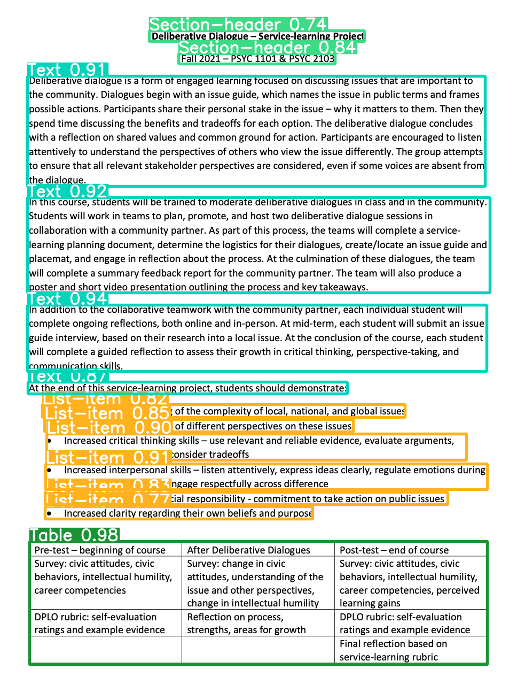
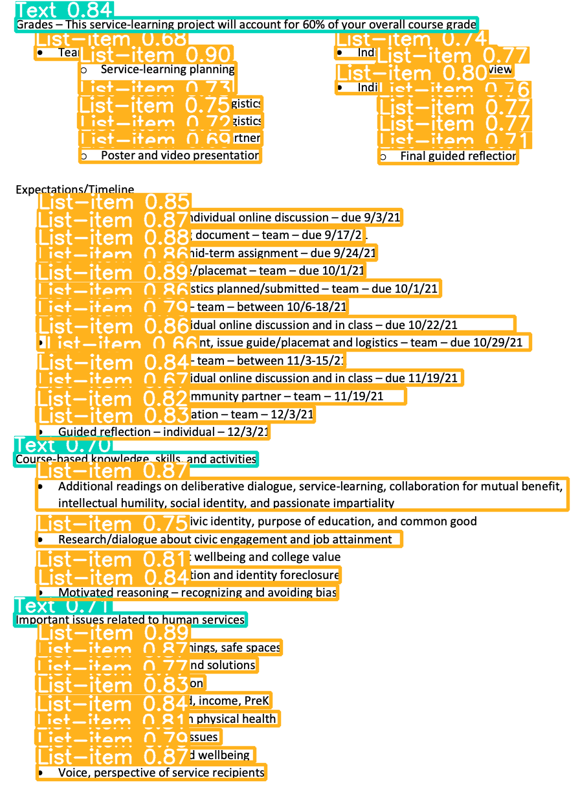

<div id="top"></div>
<!--
*** Thanks for checking out the Best-README-Template. If you have a suggestion
*** that would make this better, please fork the repo and create a pull request
*** or simply open an issue with the tag "enhancement".
*** Don't forget to give the project a star!
*** Thanks again! Now go create something AMAZING! :D
-->


<!-- PROJECT SHIELDS -->
<!--
*** I'm using markdown "reference style" links for readability.
*** Reference links are enclosed in brackets [ ] instead of parentheses ( ).
*** See the bottom of this document for the declaration of the reference variables
*** for contributors-url, forks-url, etc. This is an optional, concise syntax you may use.
*** https://www.markdownguide.org/basic-syntax/#reference-style-links
-->


<!-- PROJECT LOGO -->
<br />
<div align="center">

<h3 align="center">Layout Analysis of Scanned Documents</h3>

  <p align="center">
    Document Layout Analysis using YOLOv8
    <br />
    <a href="https://huggingface.co/spaces/linhdo/document-layout-analysis">View Demo</a>
    ·
    <a href="https://github.com/LynnHaDo/Document-Layout-Analysis/issues">Report Bug</a>
    ·
    <a href="https://github.com/LynnHaDo/Document-Layout-Analysis/issues">Request Feature</a>
  </p>
</div>

<!-- TABLE OF CONTENTS -->
<details>
  <summary>Table of Contents</summary>
  <ol>
    <li>
      <a href="#about-the-project">About The Project</a>
      <ul>
        <li><a href="#built-with">Built With</a></li>
      </ul>
    </li>
    <li>
      <a href="#getting-started">Getting Started</a>
      <ul>
        <li><a href="#prerequisites">Prerequisites</a></li>
        <li><a href="#installation">Installation</a></li>
      </ul>
    </li>
    <li><a href="#works-cited">Works Cited</a></li>
    <li><a href="#acknowledgments">Acknowledgments</a></li>
  </ol>
</details>


<!-- ABOUT THE PROJECT -->
## About The Project

Due to the lack of computational resources, I only performed the training process on the Doclaynet-base dataset which contains 6910 train images, 648 val images, 499 test images. However, the model could perform relatively well, further proving the superiority of YOLOv8 model. 




<p align="right">(<a href="#top">back to top</a>)</p>

### Built With

* [YOLOv8](https://ultralytics.com/yolov8)
* [Hugging Face Spaces](https://huggingface.co/spaces)
* [Gradio](https://www.gradio.app/)
* [Google Colab](https://colab.research.google.com/)

<p align="right">(<a href="#top">back to top</a>)</p>

<!-- GETTING STARTED -->
### Prerequisites

1. python 3
2. ultralytics
3. numpy
4. opencv-python

### Installation

1. Clone the repo
   ```sh
   git clone https://github.com/LynnHaDo/Document-Layout-Analysis.git
   ```
2. Install packages
   ```sh
   pip install ultralytics
   pip install numpy
   pip install opencv-python
   ```
3. Download [Doclaynet dataset](https://huggingface.co/datasets/ds4sd/DocLayNet) and save it as ```datasets/doclaynet-base``` 
4. (Optional) Download [pretrained YOLOv8s weights](https://github.com/ultralytics/assets/releases/download/v0.0.0/yolov8s.pt)

<p align="right">(<a href="#top">back to top</a>)</p>

<!-- Works Cited -->
## Works Cited

1. Ultralytics YOLOv8
   
   ```sh
   authors:
    - family-names: Jocher
      given-names: Glenn
      orcid: "https://orcid.org/0000-0001-5950-6979"
    - family-names: Chaurasia
      given-names: Ayush
      orcid: "https://orcid.org/0000-0002-7603-6750"
    - family-names: Qiu
      given-names: Jing
      orcid: "https://orcid.org/0000-0003-3783-7069"
   title: "YOLO by Ultralytics"
   version: 8.0.0
   date-released: 2023-1-10
   license: AGPL-3.0
   url: "https://github.com/ultralytics/ultralytics"
   ```
   
2. Doclaynet-base dataset

   ```sh
   @article{doclaynet2022,
    title = {DocLayNet: A Large Human-Annotated Dataset for Document-Layout Segmentation},
    doi = {10.1145/3534678.353904},
    url = {https://doi.org/10.1145/3534678.3539043},
    author = {Pfitzmann, Birgit and Auer, Christoph and Dolfi, Michele and Nassar, Ahmed S and Staar, Peter W J},
    year = {2022},
    isbn = {9781450393850},
    publisher = {Association for Computing Machinery},
    address = {New York, NY, USA},
    booktitle = {Proceedings of the 28th ACM SIGKDD Conference on Knowledge Discovery and Data Mining},
    pages = {3743–3751},
    numpages = {9},
    location = {Washington DC, USA},
    series = {KDD '22}
    }
   ```

<!-- CONTACT -->
## Contact

Linh Do - do24l@mtholyoke.edu/dohalinh2303@gmail.com (personal)

Project Link: [https://github.com/LynnHaDo/Document-Layout-Analysis](https://github.com/LynnHaDo/Document-Layout-Analysis)

LinkedIn: [https://linkedin.com/in/Linh Do](https://www.linkedin.com/in/linh-do-0327371b2/)

<p align="right">(<a href="#top">back to top</a>)</p>
